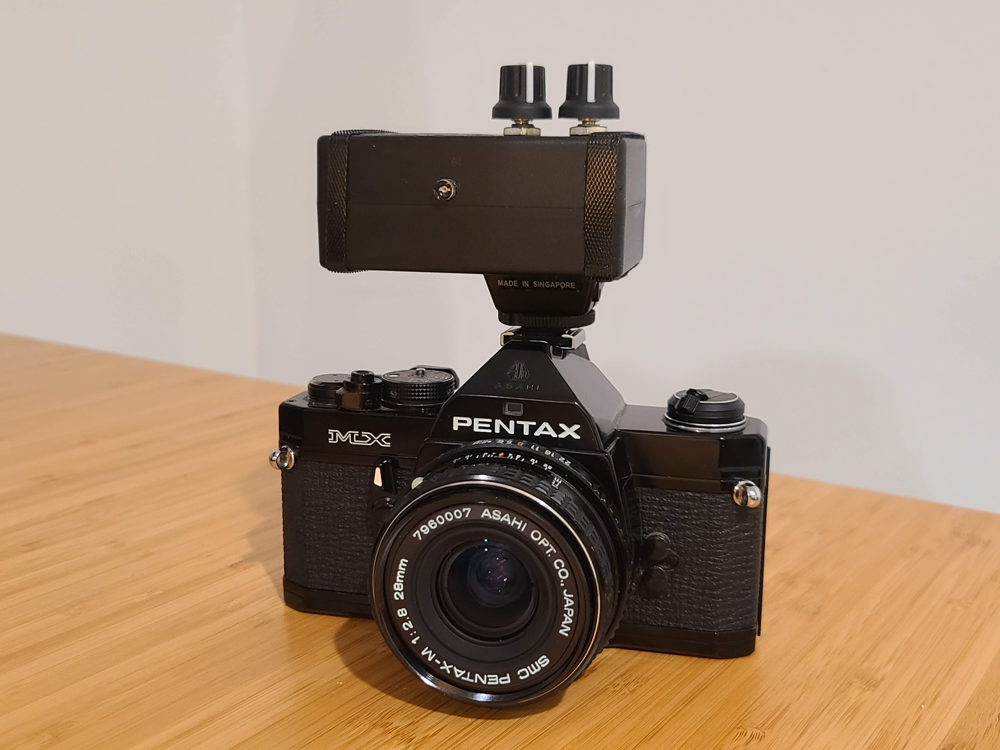
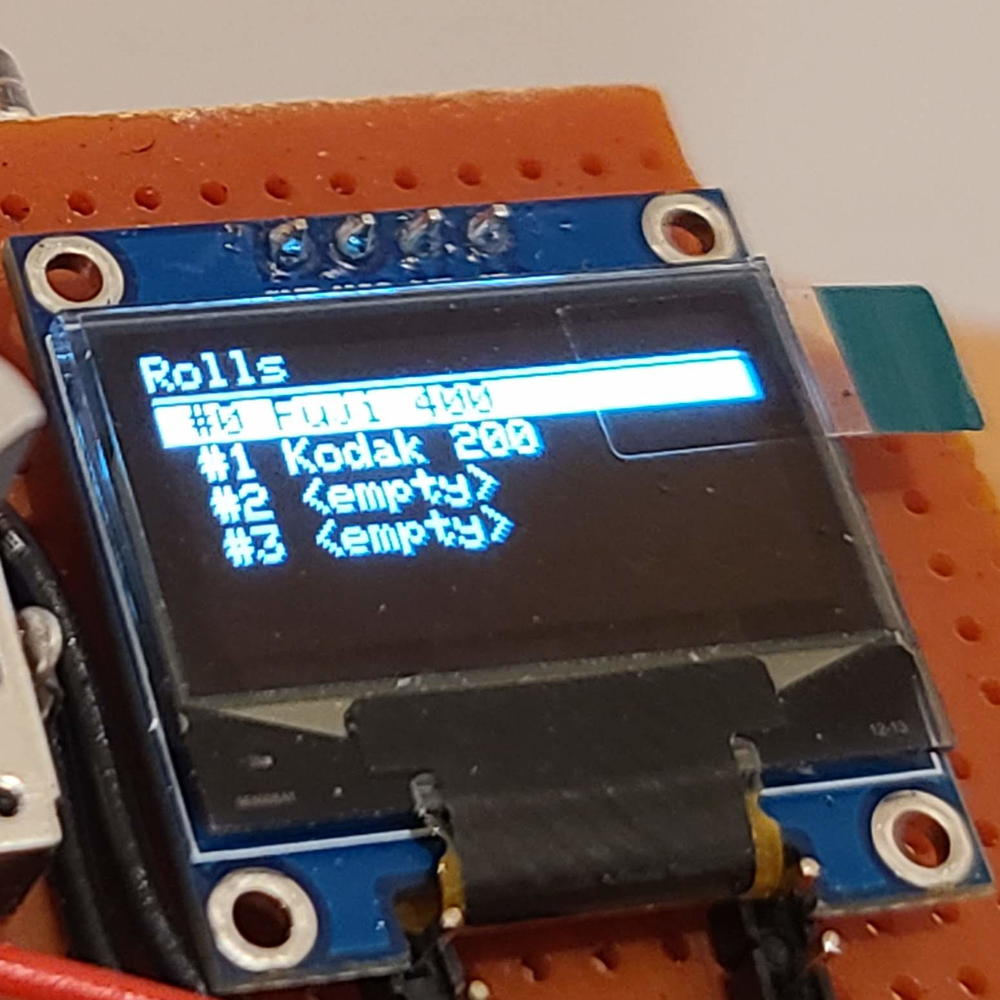
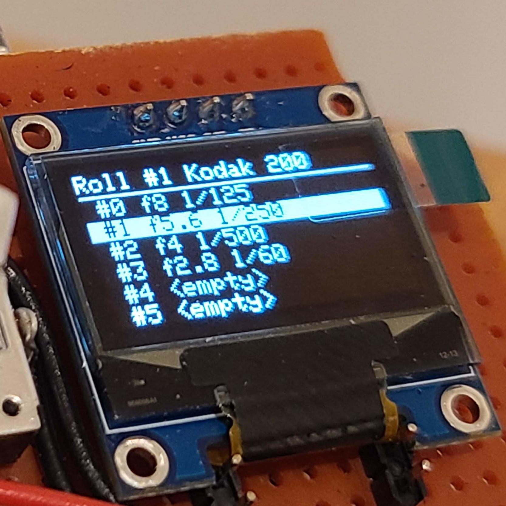
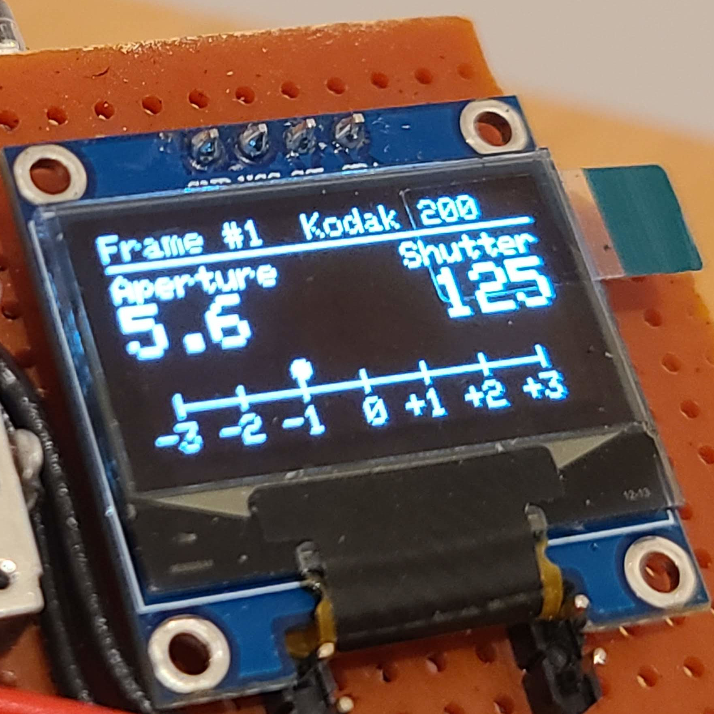
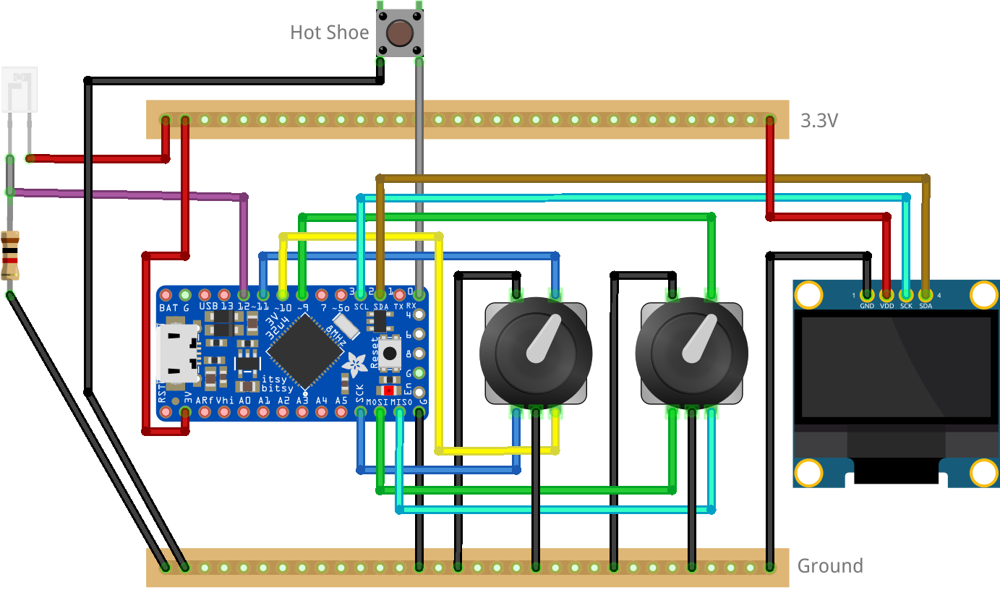
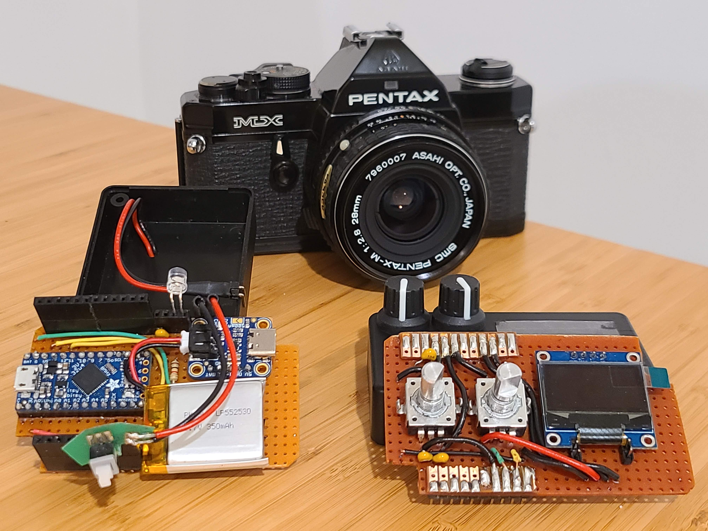
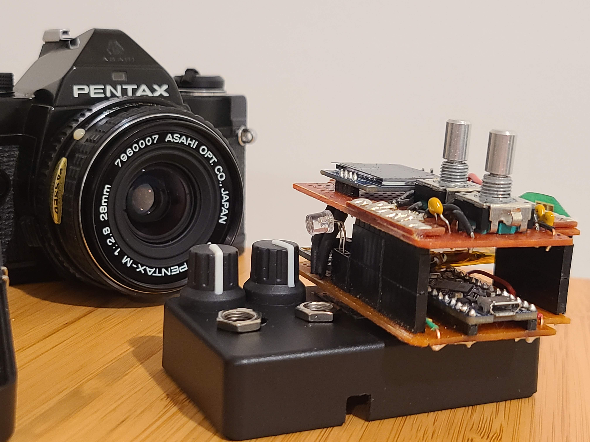

# My First Arduino Project - Film Photography Memo and Light Meter

It's been a while since I worked on a tech-related personal project.

During the holidays I picked up an Arduino-like board, to play around with.

I was wondering what project I would have fun doing with it, and decided to combine it with another hobby I picked up last year: photography and film photography.



A digital camera stores all kinds of metadata alongside each picture it takes. Arguably the most important metadata it stores are the exposure settings that were selected when taking that picture (aperture, shutter speed, ISO).

An analog film camera typically doesn't store any of this information. Some photographers carry around a notebook where they write the exposure settings for each picture they take.

Moreover, most film cameras include some electronic circuitry to determine the amount of light in the scene and help guide the photographer in picking the aperture and shutter settings to produce a correctly exposed picture. Many old film cameras, while still being mechanically working, have a long dead light meter.

I never take notes, and all my cameras have working light meters. But I needed an excuse to start a project, so here I am.

## See it in action

Below is a short video where I demonstrate the usage of the device: I create a roll and save a couple of frames.


## Parts List

- __Microcontroller__: Adafruit ItsyBitsy 32u4 3.3V. I needed a board with enough pins to manage the various controls, display, and sensors that I had in mind. I also wanted something fairly constrained in terms of speed and memory available, to make it a bit more of a fun challenge, and to ensure that it would have acceptable battery life. The ItsyBitsy costs just $9 and seemed like a suitable choice.
- __Display__: I opted for a widely available 128x64 OLED display with a SSD1306 controller that communicates with the main board via I2C. A 5-pack of this kind of display costs $15 on Amazon.
- __Controls__: I used two standard rotary encoder from Adafruit (~$4 each). Originally, I planned to add two additional push buttons, but once I started soldering the parts I realized I wouldn't have enough space, and decided to just use the buttons integrated in the rotary encoders.
- __Light Meter__: The light meter circuit is made up of a photo transistor and a 1kOhm resistor. The light meter has a useable range between 10EV and 16EV. While it's not nearly as good as an actual camera TTL reflective meter, it can be used in a pinch. And with proper calibration it could probably be pretty accurate as an incident light meter. Total cost less than $1.
- __Battery__: I used a 350mAh lithium battery from Adafruit, as well as a charging board. Cost for both ~$10.
- __Enclosure__: The enclosure is a random plastic box from Amazon that I eyeballed being an acceptable size for the project. It was later poorly cut up with household tools in order to fit the various component.
- __Hot Shoe Mount__: Taken from an old flash unit I had around.
- __Other__: Strip PCB boards, wires, capacitors to debounce the controls signals, on/off button, etc. ~$10.

While the nominal price of the parts is about $40, realistically I spent almost an order of magnitude more once you factor in extra parts bought for testing or to account for possible mistakes and the tools needed (soldering station). At least now I have plenty of spare parts for future projects.

It definitely turned out more expensive than a similar (and probably better) device I could have bought off the shelf.

## Software

The application is written in `C++`. I used the Arduino library to help with things such as reading/writing voltage from/to a IO pin, and the Adafruit SSD1306 library to help with driving the display.

The rest was written from scratch:

- __Controls__: I created some abstractions to detect changes on the pins attached to the rotary encoders and buttons using the interrupts available on the ItsyBitsy. These low-level events are queued and interpreted in the main application loop and composed into high level event such as button click, button longpress, rotary left, rotary right.
- __App State__: The application is a state machine. Each different page in the app is modeled as a separate `AppState`. An `AppState` can react to the event coming from the controls appropriately, and cause the transition to another `AppState`.

<div style="display: flex;">
  
  
  
</div>

### Minimizing Memory usage

The ItsyBitsy 32u4 has:

- 2kb of RAM
- 28kb of Flash for the program instructions
- 1kb of EEPROM to store persistent data

By the end of the project I started hitting the limits on both RAM and Flash.

On the RAM side I was able to achieve the biggest optimization by reworking the `Frame` struct. Since each `Roll` of film has 36 `Frames` and there can be multiple rolls in the app, `Frames` take up a large portion of the available RAM.

In my initial implementation of the `Frame` struct, I had two member variables enums to represent Aperture and Shutter. The `sizeof()` this struct is 4 bytes.

By refactoring `Frame` so that it has a single `uint8` member variable, and by providing getter/setter member functions that take/return the enums and using bit masks and bitwise operations I was able to reduce the `sizeof()` of the struct to 1 byte.

```c++
enum class ApertureValue {/* ... */};
enum class ShutterSpeed {/* ... */};

// An instance of BloatedFrame uses 4 bytes of memory
class BloatedFrame {
public:
  ApertureValue aperture() const { return m_aperture; }

  ShutterSpeed shutter() const { return m_shutter; }

protected:
  ApertureValue m_aperture;
  ShutterSpeed m_shutter;
};

// An instance of Frame uses 1 byte of memory
class Frame {
public:
  ApertureValue aperture() const {
    return (ApertureValue)(m_data & 0b00001111);
  }

  ShutterSpeed shutter() const {
    return (ShutterSpeed)((m_data & 0b11110000) >> 4);
  }

protected:
  uint8_t m_data;
};
```

On the program size front things were not any easier. In its current form the application uses 28,588 bytes out of the 28,672 bytes (99.7%) available on the board. I had to convert some templated classes into non-templated classes to save a few bytes here and there. I'm not sure how to reduce the binary size any further, if I want to add new features in the future.

## "Manufacturing"

I did solder a few times in the past and I was never good.

At the beginning of this project I hit a new low in the quality of my soldering, and briefly considered giving up.

A breakthrough came when I switched the soldering tips that came with my iron (conical shape) to tips with a chisel shape.

It definitely wasn't smooth sailing after getting the better tips, and working under the relatively small space constrain of the enclosure I picked didn't help. But I did get a working device in the end.

The image below shows the wiring diagram of the main components of the device. Omitted is the circuitry for the lithium battery and its charger.



In the actual device I separated the components between to boards:

- __Bottom board__: main microcontroller, connection for the camera hotshoe, light meter, battery, charger.
- __Top board__: rotary encoders and OLED display.

<div style="display: flex;">
  
  
</div>

The two boards can be stacked similarly to an Arduino hat: the male/female connections between them keeps the two parts together, and the assembly fits in the enclosure by the tightest of margins.

## Conclusion

Completing the project was fun and challenging and it taught me a thing or two.
